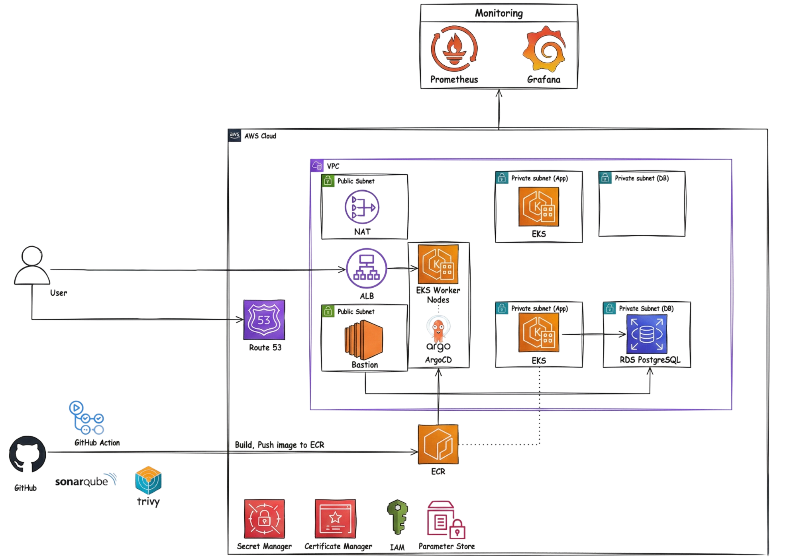
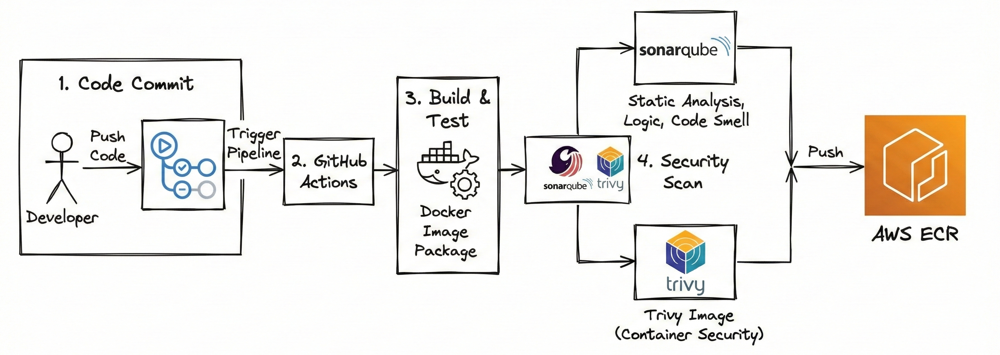

# 🎓 Hệ thống Quản lý Bài tập Lập trình - NT114 DevSecOps Project

Hệ thống web quản lý bài tập lập trình sử dụng kiến trúc microservices, triển khai trên nền tảng AWS EKS với quy trình DevSecOps hoàn chỉnh và GitOps deployment thông qua ArgoCD.

## 👥 Nhóm phát triển

- **Sinh viên**: [Hồ Công Hiếu] - [22520433]
- **Sinh viên**: [Hồ Văn Phước] - [22521151] 

## 🛠️ Công nghệ sử dụng

### 🎨 Frontend
- **⚛️ React 19** - Giao diện người dùng với TypeScript
- **🎭 Chakra UI** - Component library
- **⚡ Vite** - Build tool hiệu suất cao
- **📝 Monaco Editor** - Code editor tích hợp
- **🔗 TanStack Query & Router** - State management và routing

### ⚡ Backend (Microservices)
- **🐍 Python/Flask** - API services
- **🚪 API Gateway** - Centralized routing và authentication
- **👤 User Management Service** - Quản lý người dùng và xác thực
- **📚 Exercises Service** - Quản lý bài tập lập trình
- **📊 Scores Service** - Theo dõi điểm số và analytics
- **🗄️ PostgreSQL (RDS)** - Cơ sở dữ liệu quan hệ

### ☁️ Cloud Infrastructure (AWS)
- **☸️ Amazon EKS** - Kubernetes cluster với managed node groups
- **🌐 VPC** - Mạng ảo với public/private subnets
- **⚖️ Application Load Balancer** - Cân bằng tải với HTTPS
- **📦 Amazon ECR** - Private container registry
- **🗄️ Amazon RDS** - PostgreSQL với Multi-AZ
- **🌍 Route 53** - DNS management và routing
- **🔑 AWS Secrets Manager** - Quản lý secrets và credentials an toàn
- **🔐 AWS IAM** - Identity và access management

### 🏗️ Infrastructure as Code
- **🔧 Terraform** - Quản lý hạ tầng dưới dạng code
- **📦 Terraform Modules** - Tái sử dụng components:
  - `vpc` - Network infrastructure
  - `eks-cluster` - Kubernetes cluster
  - `eks-nodegroup` - Worker nodes
  - `rds-postgresql` - Database
  - `ecr` - Container registry
  - `alb-controller` - Load balancer
  - `bastion-host` - Secure access
  - `ebs-csi-driver` - Storage driver

### 🔄 DevSecOps CI/CD Pipeline
- **🔄 GitHub Actions** - Công cụ CI/CD của GitHub
- **🚀 ArgoCD** - GitOps continuous deployment
- **⛵ Helm** - Kubernetes package manager
- **🔍 Security Tools:**
  - **📊 SonarCloud** - Phân tích chất lượng code và bảo mật
  - **🐳 Trivy** - Quét lỗ hổng container image và dependencies

### 📊 Giám sát & Monitoring
- **📈 Prometheus** - Thu thập metrics
- **📊 Grafana** - Dashboard giám sát

## 🏗️ Kiến trúc hệ thống

### Kiến trúc tổng thể

## 🔄 CI/CD Pipeline

### DevSecOps Pipeline Overview

#### Pipeline Stages

**1. Trigger Layer**
- Quy trình được kích hoạt khi developer thực hiện `git push` lên GitHub Repository

**2. CI Layer - GitHub Actions**

- **STAGE 1: Detect Changes**
  - Sử dụng `paths-filter` để xác định service nào được thay đổi
  - Chỉ chạy pipeline cho service có thay đổi, tối ưu thời gian và tài nguyên

- **STAGE 2: Code Analysis (Shift-Left Security)**
  - **SonarCloud**: Phân tích tĩnh mã nguồn (SAST), phát hiện lỗi và lỗ hổng bảo mật
  - **Trivy**: Quét lỗ hổng CVE trong dependencies
  - **Pytest**: Chạy Unit Tests kiểm tra logic nghiệp vụ

- **STAGE 3: Build & Scan**
  - **Docker**: Đóng gói ứng dụng thành container image
  - **Trivy Image Scan**: Quét lỗ hổng bảo mật trong Docker image
  - **AWS ECR**: Push image đã được verify lên container registry

- **STAGE 4: Deploy & Verify**
  - **ArgoCD**: Tự động đồng bộ Helm Charts và deploy lên AWS EKS

### GitHub Actions - CI Pipeline

#### Quy trình CI Pipeline

1. **💻 Code Commit**
   - Developer đẩy code lên GitHub Repository

2. **⚡ Trigger Pipeline**
   - GitHub Actions tự động kích hoạt workflow

3. **🔨 Build & Test**
   - Đóng gói ứng dụng thành Docker Image
   - Chạy automated tests

4. **🔒 Security Scan**
   - **📊 SonarQube**: Quét mã nguồn tĩnh (SAST), phát hiện lỗi logic và code smell
   - **🐳 Trivy**: Quét lỗ hổng bảo mật trong Docker Image (Container Security) và toàn bộ source code

5. **📦 Push to Registry**
   - Nếu tất cả các bước đạt yêu cầu, Docker Image được verify và push lên Amazon ECR

### CD Pipeline

#### GitOps với ArgoCD

ArgoCD chạy bên trong cụm EKS để thực hiện continuous deployment:

1. **🔄 Sync & Monitor**
   - ArgoCD liên tục theo dõi Git Repository chứa cấu hình triển khai (Helm Charts/Manifests)
   - Theo dõi Amazon ECR để phát hiện Docker Image mới

2. **🚀 Auto Deploy**
   - Khi phát hiện Image mới trên ECR hoặc thay đổi trong file cấu hình
   - ArgoCD tự động đồng bộ trạng thái mới xuống cụm EKS
   - Thực hiện rolling update cho các services

3. **🔐 Security Benefits**
   - Loại bỏ việc developer truy cập trực tiếp vào Kubernetes Cluster
   - Tất cả thay đổi được audit thông qua Git history
   - Tăng cường bảo mật và khả năng rollback

## 🚀 Tính năng chính

### 👤 Quản lý Người dùng
- ✅ Đăng ký và đăng nhập
- ✅ Xác thực JWT token
- ✅ Quản lý profile người dùng
- ✅ Phân quyền (Admin/User)

### 📚 Quản lý Bài tập
- ✅ CRUD bài tập lập trình
- ✅ Phân loại theo category
- ✅ Tích hợp code editor (Monaco)
- ✅ Test cases và validation

### 📊 Theo dõi Điểm số
- ✅ Chấm điểm tự động
- ✅ Analytics và statistics
- ✅ Leaderboard
- ✅ Performance tracking

## 🔐 Security Features

### Code & Container Security
- **📊 SonarCloud** - Static code analysis và security scanning
- **🐳 Trivy** - Container image và dependency vulnerability scanning

### Runtime Security
- **📊 Prometheus** - Metrics và alerting
- **📈 Grafana** - Dashboard theo dõi
- **☁️ CloudWatch** - Công cụ giám sát của AWS

## 📊 Monitoring & Observability

### Metrics Collection
- **Prometheus**: Thu thập metrics từ tất cả services
- **Node Exporter**: System-level metrics
- **kube-state-metrics**: Kubernetes object metrics

### Visualization
- **Grafana Dashboards**:
  - Kubernetes cluster overview
  - Application performance
  - Resource utilization
  - Error rates và latency

### Alerting
- **Alert rules** cho:
  - High CPU/Memory usage
  - Pod restart loops
  - API error rates
  - Database connections

## 🤝 Contributing

1. Fork repository
2. Tạo feature branch (`git checkout -b feature/amazing-feature`)
3. Commit changes (`git commit -m 'Add amazing feature'`)
4. Push to branch (`git push origin feature/amazing-feature`)
5. Tạo Pull Request

## 📄 License

Dự án này được phát triển cho mục đích học tập, phục vụ cho Đồ án chuyên ngành tại Đại học Công nghệ Thông tin - UIT.

---

⭐ **Star this repo if you find it helpful!**
