# NT114 DevSecOps System Architecture

**Version:** 2.0
**Last Updated:** November 14, 2025
**Architecture Status:** ✅ Production Ready

---

## Executive Overview

The NT114 DevSecOps system architecture implements a modern cloud-native microservices pattern on AWS EKS with comprehensive security practices. The architecture emphasizes scalability, reliability, and security through proper separation of concerns, automated deployments, and robust access controls.

---

## High-Level Architecture

### Cloud Infrastructure Overview

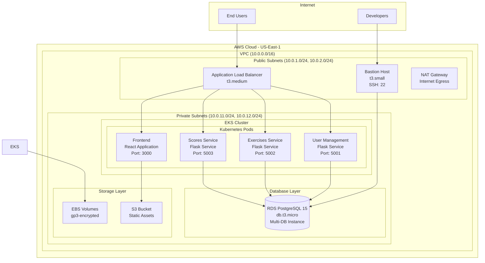

### Network Architecture

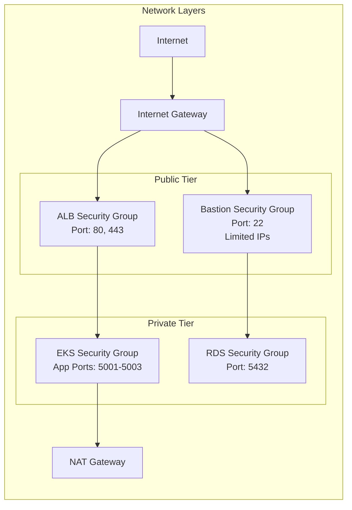

---

## Component Architecture

### 1. Kubernetes (EKS) Architecture

#### Cluster Configuration
- **Cluster Name**: `eks-1`
- **Kubernetes Version**: 1.28
- **Node Groups**: Managed node groups with auto-scaling
- **Networking**: AWS VPC CNI with Calico for network policies
- **Metadata Service**: IMDSv2 with hop limit 2 for pod-level access

#### EC2 Metadata Service Network Path

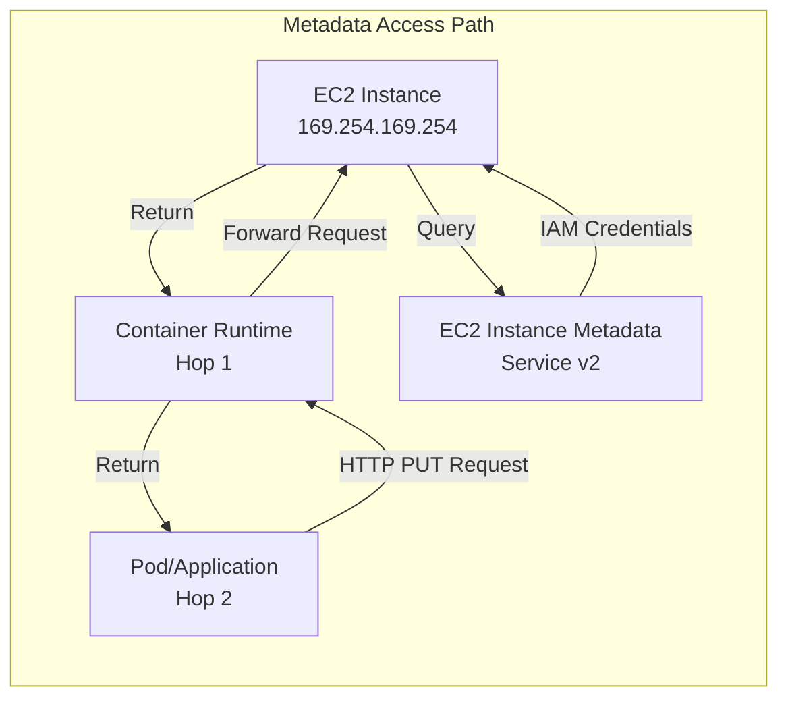

**Metadata Configuration:**
- **http_endpoint**: enabled
- **http_tokens**: required (IMDSv2 enforced)
- **http_put_response_hop_limit**: 2 (critical for pod access)
- **instance_metadata_tags**: disabled

**Why Hop Limit = 2:**
- Default hop limit of 1 only allows instance-level access
- Container runtime adds 1 hop between instance and pod
- ALB controller and other pods require hop limit of 2
- Security maintained through IMDSv2 token requirement

#### Pod Architecture

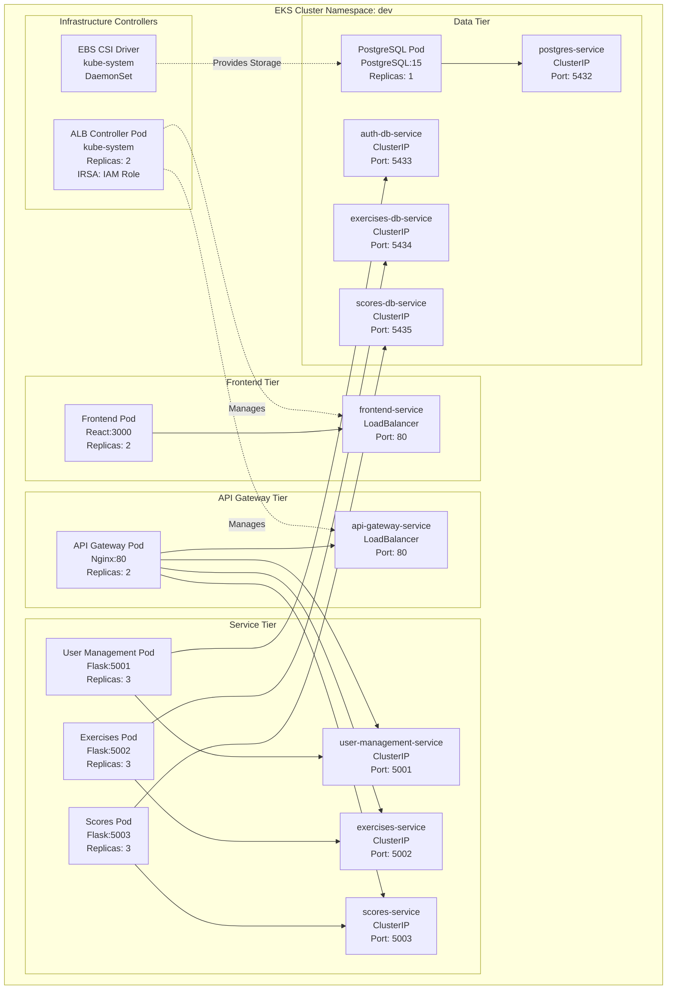

#### ALB Controller Architecture

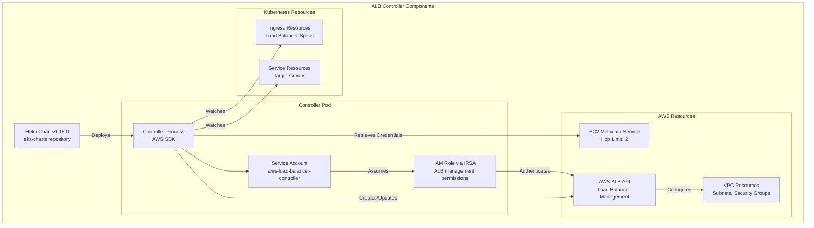

**VPC ID Passing Mechanism:**
```
terraform/environments/dev/main.tf
  └─> module.vpc.vpc_id
      └─> module.alb_controller.vpc_id (variable)
          └─> helm_release.aws_load_balancer_controller
              └─> set { vpcId = var.vpc_id }
                  └─> ALB Controller Pod Environment
```

### 2. Microservices Architecture

#### Service Communication Pattern

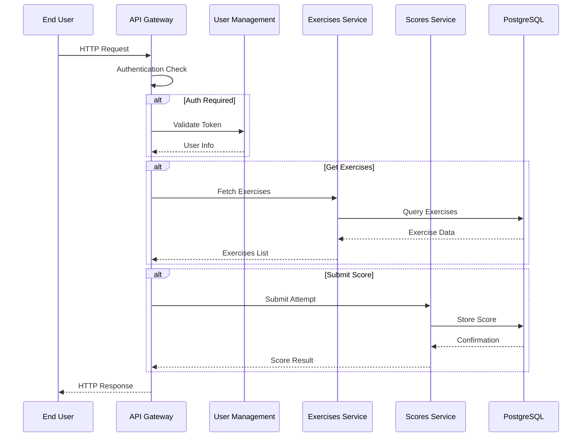

#### Service Dependencies

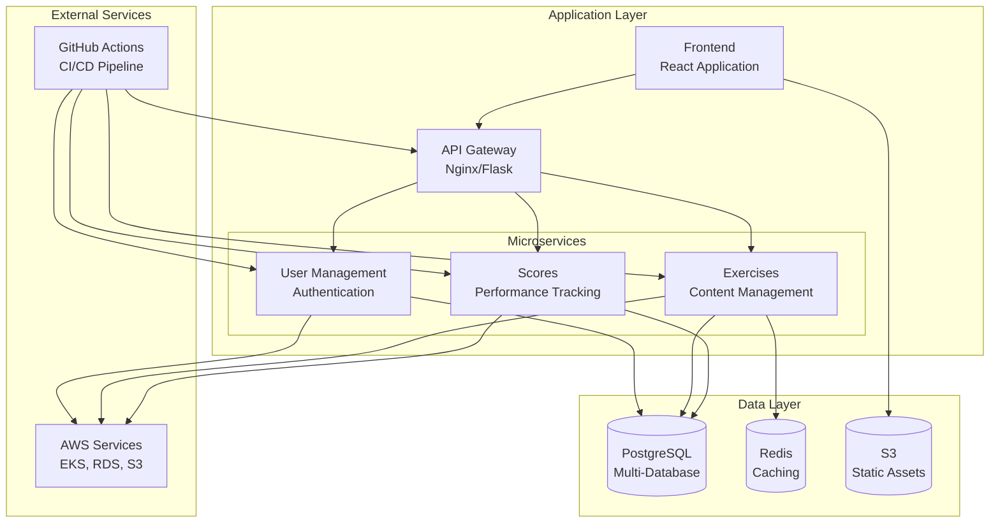

### 3. Database Architecture

#### Current Database Structure

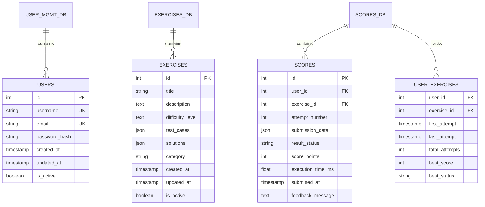

#### Planned RDS Migration Architecture

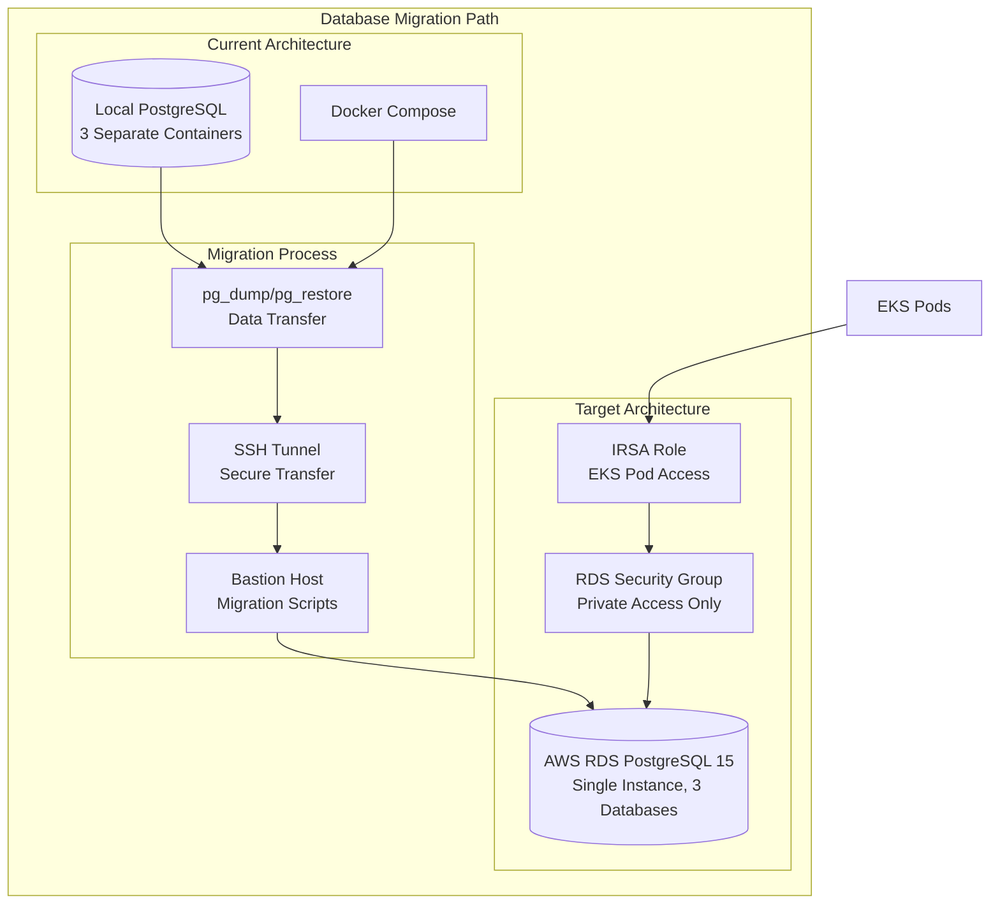

---

## Security Architecture

### 1. SSH Key Management System

#### Current SSH Infrastructure

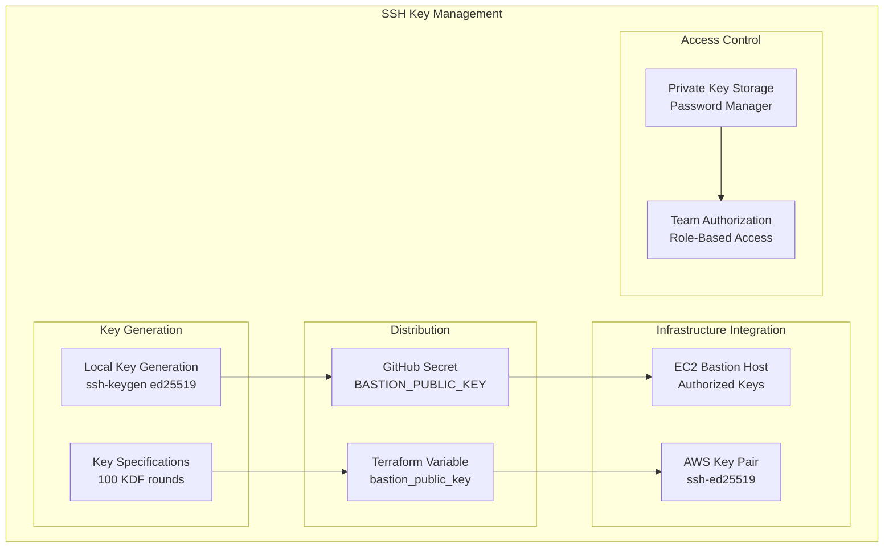

#### SSH Key Rotation Procedures

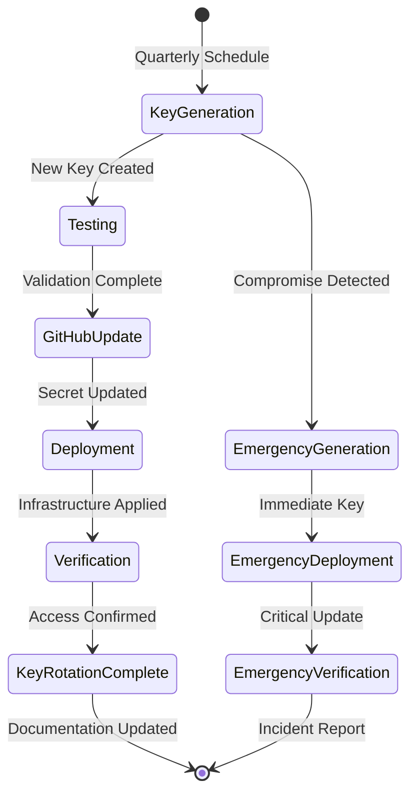

### 2. Network Security Architecture

#### VPC Security Design

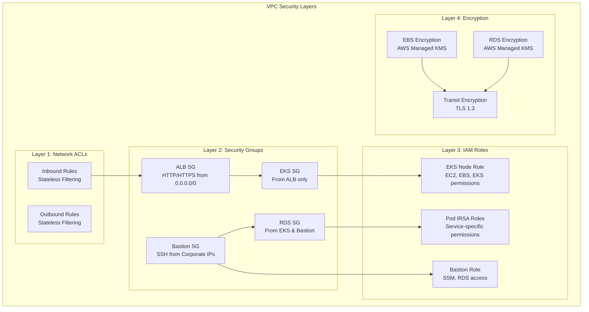

### 3. Identity and Access Management

#### IAM Architecture

```mermaid
graph TB
    subgraph "IAM Architecture"
        subgraph "GitHub Actions Access"
            GITHUB_USER[GitHub Actions User<br/>nt114-devsecops-github-actions]
            GITHUB_POLICY[GitHub Actions Policy<br/>EKS, EC2, ECR permissions]
        end

        subgraph "EKS Service Accounts"
            EKS_SA[EKS Service Accounts<br/>IRSA Integration]
            POD_POLICIES[Pod IAM Policies<br/>Least Privilege]
        end

        subgraph "Resource Roles"
            EKS_NODE_ROLE[EKS Node Role<br/>EC2, EBS, S3]
            RDS_ROLE[RDS Access Role<br/>Database permissions]
            BASTION_ROLE_SERVER[Bastion Role<br/>SSM, Systems Manager]
        end

        subgraph "Audit and Monitoring"
            CLOUDTRAIL[CloudTrail<br/>API Audit Logging]
            ACCESS_ANALYZER[IAM Access Analyzer<br/>Resource Access Analysis]
        end
    end

    GITHUB_USER --> GITHUB_POLICY
    GITHUB_POLICY --> EKS_SA
    EKS_SA --> POD_POLICIES
    POD_POLICIES --> EKS_NODE_ROLE
    EKS_NODE_ROLE --> RDS_ROLE
    RDS_ROLE --> BASTION_ROLE_SERVER
    BASTION_ROLE_SERVER --> CLOUDTRAIL
    CLOUDTRAIL --> ACCESS_ANALYZER
```

---

## CI/CD Pipeline Architecture

### 1. GitHub Actions Workflow Architecture

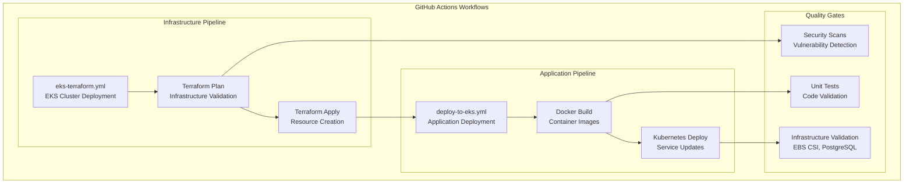

### 2. GitOps Architecture

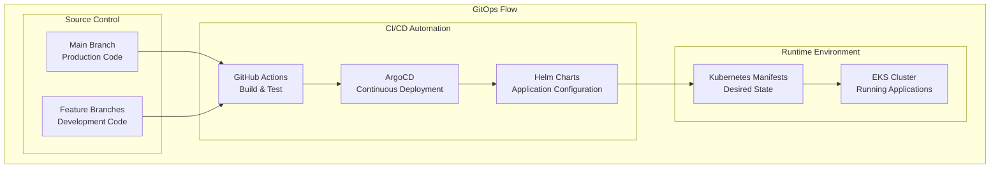

---

## Monitoring and Observability Architecture

### 1. CloudWatch Integration

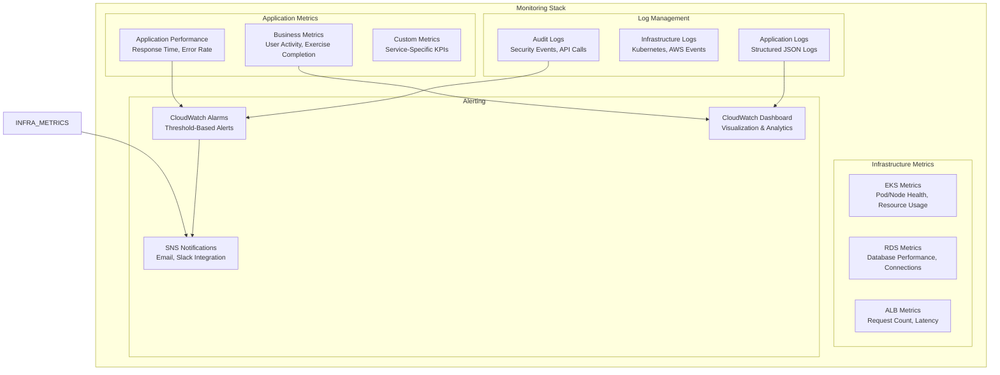

### 2. Health Check Architecture

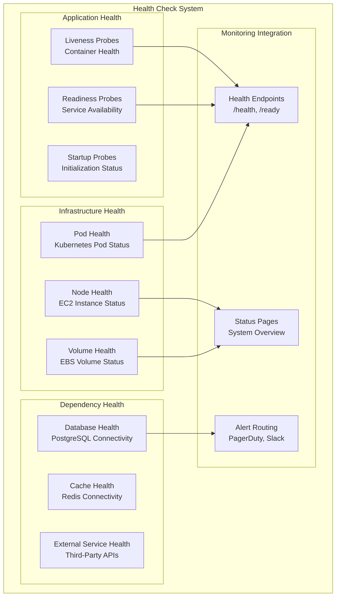

---

## Disaster Recovery and High Availability

### 1. High Availability Design

```mermaid
graph TB
    subgraph "Availability Zones"
        AZ1[AZ: us-east-1a<br/>Primary Zone]
        AZ2[AZ: us-east-1b<br/>Secondary Zone]
        AZ3[AZ: us-east-1c<br/>Tertiary Zone]
    end

    subgraph "EKS High Availability"
        CONTROL_PLANE[EKS Control Plane<br/>Multi-AZ Managed]
        NODE_GROUPS[Managed Node Groups<br/>Cross-AZ Distribution]
        AUTO_SCALING[Auto Scaling Groups<br/>Automatic Recovery]
    end

    subgraph "Data Persistence"
        RDS_MULTI_AZ[RDS Multi-AZ<br/>Automatic Failover]
        EBS_REPLICATION[EBS Replication<br/>Within AZ]
        S3_BACKUPS[S3 Backups<br/>Cross-Region Replication]
    end

    subgraph "Load Distribution"
        ALB_NLB[Application Load Balancer<br/>Multi-AZ Targets]
            DNS_FAILOVER[Route 53 Failover<br/>Health Checks]
        end
    end

    CONTROL_PLANE --> AZ1
    CONTROL_PLANE --> AZ2
    CONTROL_PLANE --> AZ3
    NODE_GROUPS --> AUTO_SCALING
    AUTO_SCALING --> RDS_MULTI_AZ
    RDS_MULTI_AZ --> EBS_REPLICATION
    EBS_REPLICATION --> S3_BACKUPS
    S3_BACKUPS --> ALB_NLB
    ALB_NLB --> DNS_FAILOVER
```

### 2. Backup and Recovery Strategy

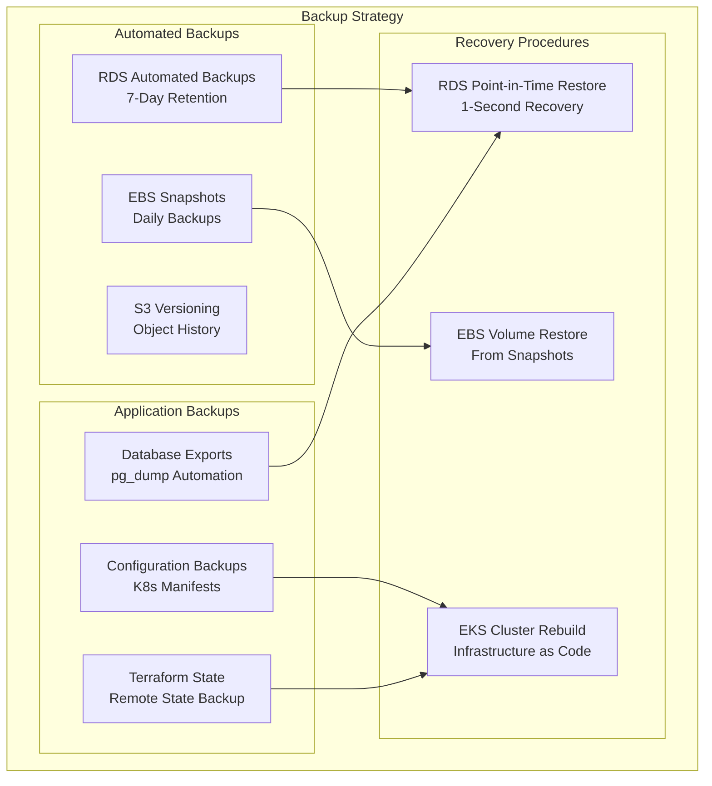

---

## Performance and Scaling Architecture

### 1. Auto Scaling Design

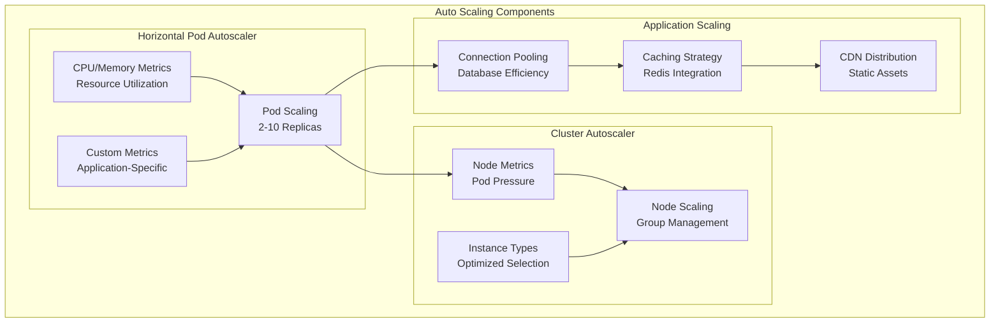

### 2. Performance Optimization Architecture

```mermaid
graph TB
    subgraph "Performance Layers"
        subgraph "Frontend Optimization"
            STATIC_ASSETS[Static Assets<br/>CDN Caching]
            BUNDLE_OPTIMIZATION[Bundle Optimization<br/>Code Splitting]
            LAZY_LOADING[Lazy Loading<br/>Progressive Enhancement]
        end

        subgraph "API Optimization"
            RESPONSE_CACHING[Response Caching<br/>API Gateway Cache]
            RATE_LIMITING[Rate Limiting<br/>DDoS Protection]
            COMPRESSION[Compression<br/>Gzip/Brotli]
        end

        subgraph "Database Optimization"
            QUERY_OPTIMIZATION[Query Optimization<br/>Index Strategy]
            CONNECTION_POOLING_DB[Connection Pooling<br/>PgBouncer]
            READ_REPLICAS[Read Replicas<br/>Load Distribution]
        end

        subgraph "Infrastructure Optimization"
            INSTANCE_TYPES_OPT[Instance Types<br/>Right-Sizing]
            STORAGE_OPTIMIZATION[Storage Optimization<br/>gp3/IO2]
            NETWORK_OPTIMIZATION[Network Optimization<br/>Enhanced Networking]
        end
    end

    STATIC_ASSETS --> RESPONSE_CACHING
    BUNDLE_OPTIMIZATION --> RATE_LIMITING
    LAZY_LOADING --> COMPRESSION
    RESPONSE_CACHING --> QUERY_OPTIMIZATION
    RATE_LIMITING --> CONNECTION_POOLING_DB
    COMPRESSION --> READ_REPLICAS
    QUERY_OPTIMIZATION --> INSTANCE_TYPES_OPT
    CONNECTION_POOLING_DB --> STORAGE_OPTIMIZATION
    READ_REPLICAS --> NETWORK_OPTIMIZATION
```

---

## Technology Stack Summary

### Core Technologies

| Component | Technology | Version | Purpose |
|-----------|------------|---------|---------|
| **Container Runtime** | Docker | Latest | Containerization |
| **Orchestration** | Kubernetes (EKS) | 1.28 | Container orchestration |
| **Infrastructure** | Terraform | Latest | IaC management |
| **CI/CD** | GitHub Actions | Latest | Automation pipeline |
| **Load Balancer** | AWS ALB | Latest | Traffic distribution |
| **Database** | PostgreSQL | 15.7 | Primary data store |
| **Frontend** | React | Latest | User interface |
| **Backend** | Python Flask | Latest | API services |
| **Monitoring** | CloudWatch | Latest | Observability |
| **Security** | IAM/KMS | Latest | Access control |

### Security Tools

| Tool | Purpose | Implementation |
|------|---------|----------------|
| **SSH Key Management** | Bastion host access | ED25519 keys with rotation |
| **IAM Roles** | Service permissions | IRSA for EKS pods |
| **Security Groups** | Network security | Layer 4 filtering |
| **KMS** | Encryption | Data at rest |
| **TLS** | Transit encryption | End-to-end encryption |
| **Network ACLs** | Network security | Stateless filtering |

---

## Architecture Decision Records (ADRs)

### ADR-001: Microservices Architecture
**Status**: Implemented ✅
**Decision**: Adopt microservices architecture with separate services for user management, exercises, and scores.
**Rationale**: Better scalability, independent deployment, and technology flexibility.

### ADR-002: EKS over ECS
**Status**: Implemented ✅
**Decision**: Use Amazon EKS for container orchestration instead of ECS.
**Rationale**: Kubernetes ecosystem, better community support, and advanced networking capabilities.

### ADR-003: GitHub Actions CI/CD
**Status**: Implemented ✅
**Decision**: Use GitHub Actions for CI/CD pipeline instead of Jenkins or other tools.
**Rationale**: Native GitHub integration, better YAML configuration, and managed service.

### ADR-004: SSH Key Bastion Access
**Status**: Implemented ✅
**Decision**: Implement SSH key-based access through bastion host for database management.
**Rationale**: Enhanced security, audit trail, and centralized access control.

### ADR-005: RDS Migration Strategy
**Status**: Planned 📋
**Decision**: Migrate from local PostgreSQL to AWS RDS with zero-downtime approach.
**Rationale**: Managed service, better reliability, and automated backups.

---

## Future Architecture Enhancements

### Planned Improvements

#### 1. Enhanced Security (Q1 2026)
- **OIDC Authentication**: Replace static AWS credentials with GitHub OIDC
- **Secrets Manager**: Integrate AWS Secrets Manager for application secrets
- **Advanced Monitoring**: Implement security monitoring and threat detection

#### 2. Performance Optimizations (Q2 2026)
- **Read Replicas**: Implement RDS read replicas for query performance
- **CDN Integration**: Deploy CloudFront for global content delivery
- **Database Optimization**: Advanced PostgreSQL tuning and indexing

#### 3. Multi-Environment Support (Q3 2026)
- **Staging Environment**: Full staging environment for production testing
- **Environment Promotion**: Automated environment promotion workflows
- **Configuration Management**: Advanced configuration management strategies

---

## Conclusion

The NT114 DevSecOps system architecture represents a modern, secure, and scalable cloud-native implementation. The current architecture successfully demonstrates:

- **Operational Excellence**: Automated CI/CD pipeline with comprehensive error handling
- **Security**: Defense-in-depth approach with SSH key management and network isolation
- **Reliability**: High availability design with proper backup and disaster recovery
- **Performance**: Scalable architecture with auto-scaling capabilities
- **Cost Optimization**: Right-sized resources with efficient resource utilization

The architecture is production-ready with a clear roadmap for future enhancements and optimizations.

---

**Document Version**: 2.1
**Last Updated**: November 20, 2025
**Next Review**: December 20, 2025
**Architecture Status**: ✅ Production Ready
**Recent Updates**: EC2 metadata network path, ALB controller architecture diagrams